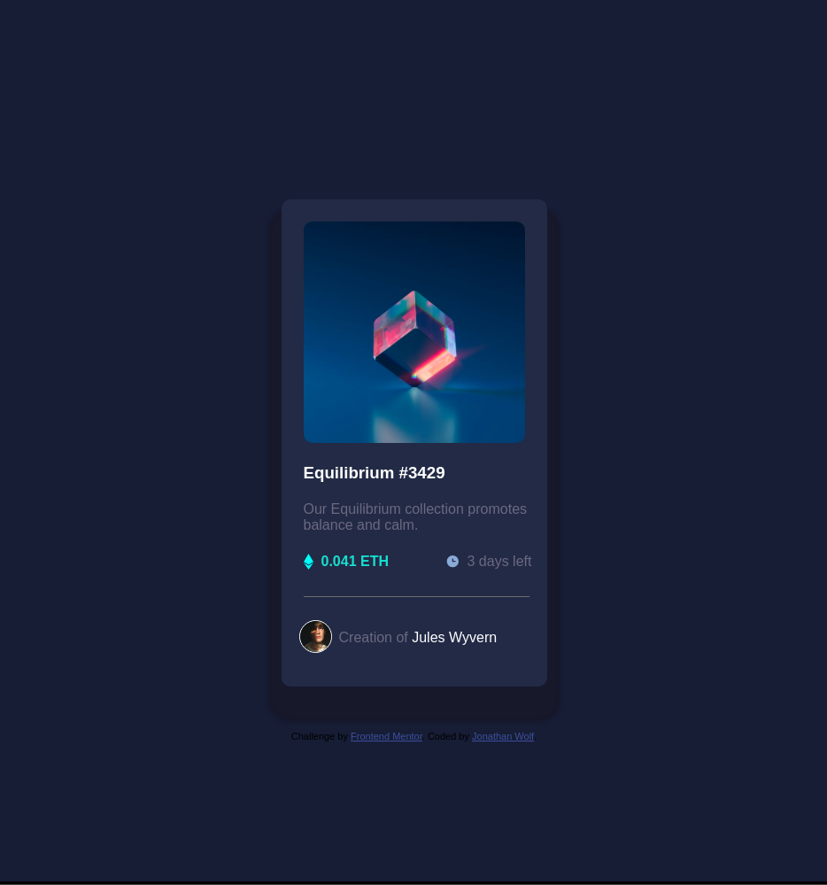

# Frontend Mentor - NFT preview card component solution

This is a solution to the [NFT preview card component challenge on Frontend Mentor](https://www.frontendmentor.io/challenges/nft-preview-card-component-SbdUL_w0U). Frontend Mentor challenges help you improve your coding skills by building realistic projects. 

## Table of contents

- [Overview](#overview)
  - [The challenge](#the-challenge)
  - [Screenshot](#screenshot)
  - [Links](#links)
- [My process](#my-process)
  - [Built with](#built-with)
  - [What I learned](#what-i-learned)
  - [Continued development](#continued-development)
  - [Useful resources](#useful-resources)
- [Author](#author)
- [Acknowledgments](#acknowledgments)

## Overview

### The challenge

Users should be able to:

- View the optimal layout depending on their device's screen size
- See hover states for interactive elements

### Screenshot



### Links

- [Live Site](https://jwolf9.github.io/nft-preview-card-component-main/)

## My process

### Built with

- HTML
- CSS
- Flexbox

### What I learned

Use rem for font size rather than px

```css
.attribution { 
    position: relative;
    top: 50px;
    font-size: 1.1rem;
}
```

Use flexbox to center elements vertically and horizontally

```css
body {
    background-color: rgb(22, 30, 54);
    font-family: Verdana, Geneva, Tahoma, sans-serif;
    display: flex;
    height: 100vh;
    align-items: center;
    justify-content: center;
    flex-direction: column;
    font-size: 1.6rem;
}
```

Create shadows for elements

```css
.card {
    position: relative;
    width: 300px;
    height: 550px;
    border-radius: 10px;
    box-shadow: 0px 25px 4px 15px #17182b;
    background-color: rgb(34, 43, 71);
}
```

Use landscape elements to make site more accessible

```html
<main>
  ...
</main>
<footer>
  ...
</footer>
```

Create transitions when hovering over elements
```css
.mask:hover .background {
    opacity: 0.5;
    transition: 1s;
    cursor: pointer;
}
```

### Continued development

I want to get more familiar with using flexbox and how to use max-width to make the pages more responsive to resizing

### Useful resources

- [Intro to flexbox](https://css-tricks.com/snippets/css/a-guide-to-flexbox/)
- [A blog for how to design shadows](https://www.example.com)

## Author

- Frontend Mentor - [@jwolf9](https://www.frontendmentor.io/profile/jwolf9)
